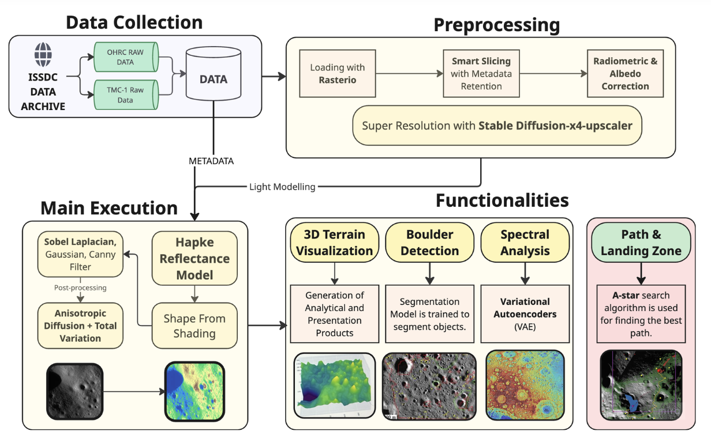
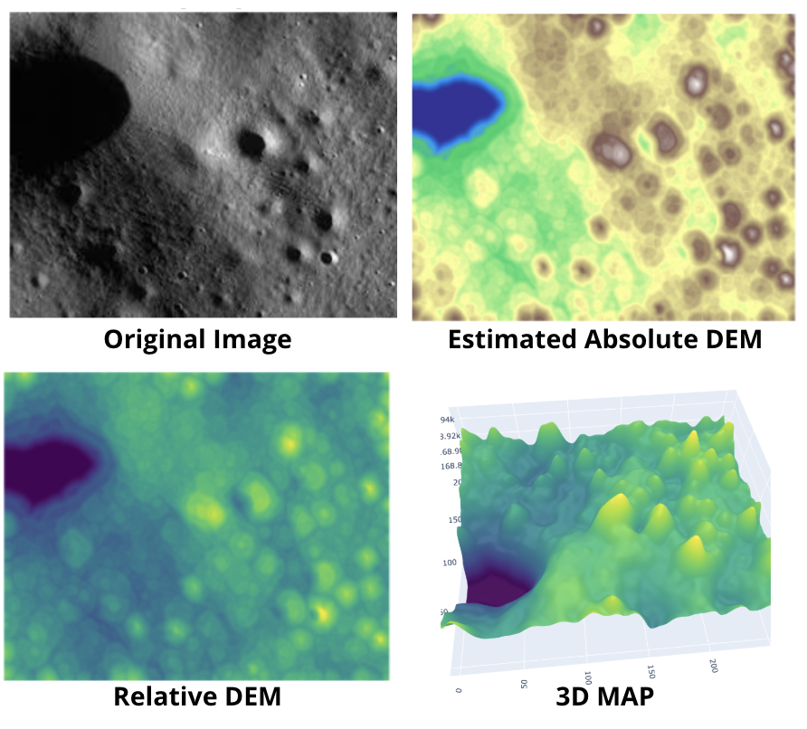

# Lunar Surface Elevation Modelling

A comprehensive Python package for generating Digital Elevation Models (DEMs) from lunar satellite imagery using advanced photoclinometry and Shape-from-Shading techniques.

## 🌙 Features

- **Photoclinometry DEM Generation**: Shape-from-Shading (SFS) algorithms for lunar surface reconstruction
- **Multiple Reflectance Models**: Lambertian and Hapke reflectance models for accurate lunar surface modeling
- **Image Enhancement**: CLAHE (Contrast Limited Adaptive Histogram Equalization) preprocessing
- **Super Resolution**: Stable Diffusion-based image upscaling for enhanced detail
- **Comprehensive Visualization**: 2D/3D DEM visualization and analysis tools
- **ISRO Data Integration**: Support for ISRO lunar mission data formats (OATH, OAT, SPM, LBR)

## 📁 Project Structure

```
SurfaceElevationModelling/
├── src/                          # Main source code
│   ├── utils/                    # Utility functions
│   │   └── data_parser.py        # ISRO data file parsing
│   ├── models/                   # Core algorithms
│   │   ├── reflectance_models.py # Lambertian and Hapke models
│   │   ├── photoclinometry.py    # Shape-from-Shading algorithms
│   │   └── super_resolution.py   # Image upscaling
│   ├── preprocessing/            # Image preprocessing
│   │   └── image_enhancement.py  # CLAHE and normalization
│   ├── visualization/            # Visualization tools
│   │   └── dem_visualizer.py     # DEM plotting and analysis
│   └── lunar_dem_pipeline.py     # Main pipeline integration
├── notebooks/                    # Jupyter notebooks
│   ├── 01_basic_dem_generation.ipynb
│   ├── 02_hapke_clahe_dem.ipynb
│   └── 03_super_resolution.ipynb
├── outputs/                      # Generated outputs
│   ├── dem/                      # DEM files (.npy)
│   ├── images/                   # Image outputs
│   └── figures/                  # Visualization plots
├── data/                         # Input data (ISRO files)
├── requirements.txt              # Python dependencies
└── README.md                     # This file
```
### OUTPUTS

| Pipeline Visualization | DEM Output Example |
|------------------------|-------------------|
|  |  |

## 🚀 Quick Start

### Installation

1. Clone the repository:
```bash
git clone https://github.com/yourusername/SurfaceElevationModelling.git
cd SurfaceElevationModelling
```

2. Install dependencies:
```bash
pip install -r requirements.txt
```

3. Prepare your data:
   - Place ISRO data files in the `data/` directory:
     - `params.oath` (Orbit Attitude Header)
     - `params.oat` (Orbit Attitude)
     - `sun_params.spm` (Sun Parameters)
     - `params.lbr` (Lunar Body Reference)
   - Add your lunar image to `data/test_image.jpg`

### Basic Usage

```python
from src.lunar_dem_pipeline import LunarDEMPipeline

# Create pipeline
pipeline = LunarDEMPipeline(
    data_dir="data",
    output_dir="outputs",
    use_hapke=False,  # Use Lambertian model
    apply_clahe=True,
    iterations=1000
)

# Generate DEM
results = pipeline.run_full_pipeline("data/test_image.jpg", "my_dem")
```

### Jupyter Notebooks

1. **Basic DEM Generation** (`notebooks/01_basic_dem_generation.ipynb`)
   - Simple Lambertian model DEM generation
   - Basic visualization and analysis

2. **Hapke Model with CLAHE** (`notebooks/02_hapke_clahe_dem.ipynb`)
   - Advanced Hapke reflectance model
   - CLAHE preprocessing for enhanced results

3. **Super Resolution** (`notebooks/03_super_resolution.ipynb`)
   - Stable Diffusion image upscaling
   - Comparison with traditional methods

## 🔧 Architecture

### Core Components

#### 1. Data Parser (`src/utils/data_parser.py`)
- Parses ISRO lunar mission data files
- Extracts sun angles, satellite positions, and timing information
- Supports OATH, OAT, SPM, and LBR file formats

#### 2. Reflectance Models (`src/models/reflectance_models.py`)
- **Lambertian Model**: Simple diffuse reflection model
- **Hapke Model**: Advanced lunar surface reflectance model
- Sun and view vector calculations

#### 3. Photoclinometry (`src/models/photoclinometry.py`)
- Iterative Shape-from-Shading algorithm
- Surface normal calculation from DEM gradients
- Convergence monitoring and smoothing

#### 4. Image Enhancement (`src/preprocessing/image_enhancement.py`)
- CLAHE preprocessing for contrast enhancement
- Image normalization and resizing
- Multi-scale processing support

#### 5. Super Resolution (`src/models/super_resolution.py`)
- Stable Diffusion upscaler integration
- Traditional interpolation methods
- Comparison and evaluation tools

#### 6. Visualization (`src/visualization/dem_visualizer.py`)
- 2D and 3D DEM visualization
- Elevation profiles and histograms
- Comprehensive analysis plots

### Pipeline Integration

The main pipeline (`src/lunar_dem_pipeline.py`) orchestrates all components:

1. **Data Loading**: Parse ISRO mission data
2. **Image Preprocessing**: Apply CLAHE and normalization
3. **DEM Generation**: Run Shape-from-Shading algorithm
4. **Results Saving**: Save DEMs and statistics
5. **Visualization**: Generate comprehensive plots

## 📊 Outputs

The pipeline generates several types of outputs:

### DEM Files
- `*_relative.npy`: Relative DEM from SFS
- `*_absolute.npy`: Absolute DEM with elevation values
- `*_relative.png`: Visualized relative DEM
- `*_absolute.png`: Visualized absolute DEM

### Visualizations
- `*_2d.png`: 2D DEM visualization
- `*_3d.png`: 3D DEM surface plot
- `*_comparison.png`: Original vs DEM comparison
- `*_histogram.png`: Elevation distribution

### Statistics
- Elevation statistics (min, max, mean, std)
- Processing parameters and convergence info

## 🎯 Use Cases

### Lunar Science
- **Crater Analysis**: Study impact crater morphology
- **Surface Roughness**: Analyze lunar regolith properties
- **Geological Mapping**: Identify surface features and structures

### Mission Planning
- **Landing Site Selection**: Assess terrain suitability
- **Rover Path Planning**: Generate elevation maps for navigation
- **Resource Mapping**: Identify areas of scientific interest

### Education and Outreach
- **Lunar Visualization**: Create educational materials
- **Public Engagement**: Generate compelling lunar imagery
- **Research Training**: Teach photogrammetry concepts

## 🔬 Technical Details

### Algorithms

#### Shape-from-Shading (SFS)
- Iterative optimization algorithm
- Surface normal calculation from gradients
- Convergence monitoring with configurable thresholds
- Gaussian smoothing for noise reduction

#### Reflectance Models

**Lambertian Model:**
```
I = albedo * cos(θi) * cos(θe)
```

**Hapke Model:**
```
r = w/4/(μ₀+μ) * (1+B) * P * H(μ) * H(μ₀)
```

### Performance Considerations
- **GPU Acceleration**: CUDA support for Stable Diffusion
- **Memory Management**: Efficient array operations
- **Convergence**: Configurable iteration limits and thresholds
- **Scalability**: Support for large image datasets

## 🤝 Contributing

1. Fork the repository
2. Create a feature branch (`git checkout -b feature/amazing-feature`)
3. Commit your changes (`git commit -m 'Add amazing feature'`)
4. Push to the branch (`git push origin feature/amazing-feature`)
5. Open a Pull Request

## 📝 License

This project is licensed under the MIT License - see the [LICENSE](LICENSE) file for details.

## 🙏 Acknowledgments

- **ISRO**: For lunar mission data and scientific collaboration
- **Stability AI**: For Stable Diffusion upscaler models
- **Scientific Community**: For foundational research in photoclinometry

## 📞 Contact

For questions and support:
- **Email**: your.email@example.com
- **Issues**: [GitHub Issues](https://github.com/yourusername/SurfaceElevationModelling/issues)
- **Documentation**: [Wiki](https://github.com/yourusername/SurfaceElevationModelling/wiki)

---

**Note**: This project is designed for research and educational purposes. Always validate results against ground truth data when available. 